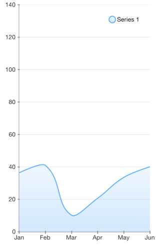

# Chart Series: Spline Area

<code>TKChartSplineAreaSeries</code> series is a derivative of TKChartAreaSeries. It allows the area between the curve and the corresponding axis to be colored in an arbitrary way. Below is a sample snippet that demonstrates how to set up a spline series:

```Objective-C
NSMutableArray *pointsWithCategoriesAndValues = [[NSMutableArray alloc] init];
NSArray *categories = @[ @"Greetings", @"Perfecto", @"NearBy", @"Family Store", @"Fresh & Green" ];
NSArray *values = @[@70, @75, @58, @59, @88 ];
for (int i = 0; i < categories.count; i++) {
    TKChartDataPoint *dataPoint = [[TKChartDataPoint alloc] initWithX:categories[i] Y:values[i]];
    [pointsWithCategoriesAndValues addObject:dataPoint];
}

TKChartSplineAreaSeries *series = [[TKChartSplineAreaSeries alloc] initWithItems:pointsWithCategoriesAndValues];
[chart addSeries:series];
```
```Swift
let categories = ["Greetings", "Perfecto", "NearBy", "Family Store", "Fresh & Green" ];
let values = [70, 75, 58, 59, 88]
var pointsWithCategoriesAndValues = [TKChartDataPoint]()
for var i = 0; i < categories.count; ++i {
    pointsWithCategoriesAndValues.append(TKChartDataPoint(x: categories[i], y: values[i]))
}
    
let series = TKChartSplineAreaSeries(items: pointsWithCategoriesAndValues)
chart.addSeries(series)
```
```C#
var categories = new [] { "Greetings", "Perfecto", "NearBy", "Family Store", "Fresh & Green" };
var values = new [] { 70, 75, 58, 59, 88 };
var pointsWithCategoriesAndValues = new List<TKChartDataPoint> ();
for (int i = 0; i < categories.Length; ++i) {
	pointsWithCategoriesAndValues.Add (new TKChartDataPoint (new NSString (categories [i]), new NSNumber (values [i])));
}
chart.AddSeries (new TKChartSplineAreaSeries (pointsWithCategoriesAndValues.ToArray ()));
```



