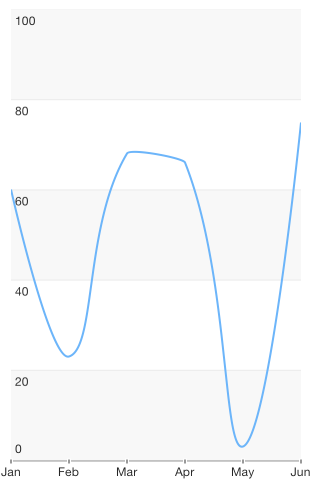

# Chart Series: Spline

<code>TKChartSpineSeries</code> is similar to the line series, but instead of straight line segments, the spline series connects its data points with smooth curves which represent rough approximations of the missing data points. Here is an example of a chart with a spline series:

```Objective-C
NSMutableArray *profitData = [[NSMutableArray alloc] init];
NSArray *profitValues = @[@10, @45, @8, @27, @57];
NSArray *categories = @[@"Greetings", @"Perfecto", @"NearBy", @"Family Store", @"Fresh & Green"];
for (int i = 0; i < categories.count ; i++) {
    [profitData addObject:[TKChartDataPoint dataPointWithX:categories[i] Y:profitValues[i]]];
}

TKChartSplineSeries *seriesForProfit = [[TKChartSplineSeries alloc] initWithItems:profitData];
[chart addSeries:seriesForProfit];
```
```Swift
var profitData = [TKChartDataPoint]()
let profitValues = [10, 45, 8, 27, 57]
let categories = ["Greetings", "Perfecto", "NearBy", "Family Store", "Fresh & Green"]
for var i = 0; i < categories.count; ++i {
    profitData.append(TKChartDataPoint(x: categories[i], y: profitValues[i]))
}

let seriesForProfit = TKChartSplineSeries(items: profitData)
chart.addSeries(seriesForProfit)
```



As TKChartSplineSeries derives from TKChartLineSeries, it shares the same functionality.
