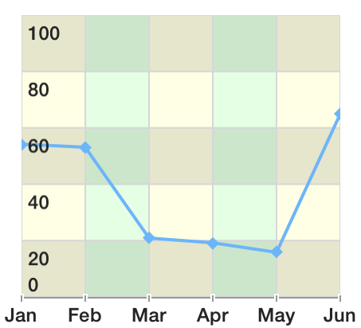
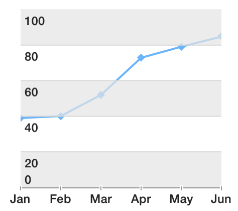

# Chart: Grid Customization

TKChart series, which support axes, can render a grid that facilitates the process of determining the values of points afar from the axes. Since Pie area does not use axes, the grid is valid only in the context of Cartesian series. Grid consists of horizontal and vertical lines matching axes major ticks and fills between them. You can alternate fills to create zebra like effect both horizontally and vertically.

The essential properties of <code>TKChartGridStyle</code> are the following:

- <code>verticalLineStroke</code> - defines the vertical line stroke.
- <code>verticalLineAlternateStroke</code> - defines the vertical alternate line stroke.
- <code>verticalLinesHidden</code> - determines whether the vertical line is hidden.
- <code>verticalFill</code> - defines the background pattern of fill among vertical lines.
- <code>verticalAlternateFill</code> - defines the background pattern of alternate fill among vertical lines.
- <code>horizontalLineStroke</code> - defines the horizontal line stroke.
- <code>horizontalLineAlternateStroke</code> - defines the horizontal alternate line stroke
- <code>horizontalLinesHidden</code> - determines whether the hidden line is hidden.
- <code>horizontalFill</code> - defines the background pattern of fill among horizontal lines
- <code>horizontalAlternateFill</code> - defines the background pattern of alternate fill among horizontal lines
- <code>backgroundFill</code> - sets the background fill color. By default, it is nil (no background color is drawn).
- <code>drawOrder</code> - sets the draw order. By default, it is TKGridDrawModeHorizontalFirst.
- <code>zPosition</code> - defines the grid position according to the series.

## Customizing grid appearance

Working with grid style properties is easy. Here is a way to make colorful grid lines:

```Objective-C
TKChartGridStyle* gridStyle = chart.gridStyle;
gridStyle.verticalLineStroke = [TKStroke strokeWithColor:[UIColor blackColor]];
gridStyle.verticalLineAlternateStroke = [TKStroke strokeWithColor:[UIColor blackColor]];
gridStyle.verticalLinesHidden = NO;
gridStyle.verticalFill = nil;
gridStyle.verticalAlternateFill = nil;
gridStyle.horizontalLineStroke = [TKStroke strokeWithColor:[UIColor redColor]];
gridStyle.horizontalLineAlternateStroke = [TKStroke strokeWithColor:[UIColor blueColor]];
gridStyle.horizontalFill = nil;
gridStyle.horizontalAlternateFill = nil;
gridStyle.horizontalLinesHidden = NO;
```
```Swift
let gridStyle = chart.gridStyle()
gridStyle.verticalLineStroke = TKStroke(color: UIColor.blackColor())
gridStyle.verticalLineAlternateStroke = TKStroke(color: UIColor.blackColor())
gridStyle.verticalLinesHidden = false
gridStyle.verticalFill = nil
gridStyle.verticalAlternateFill = nil     
gridStyle.horizontalLineStroke = TKStroke(color: UIColor.redColor())
gridStyle.horizontalLineAlternateStroke = TKStroke(color: UIColor.blueColor())
gridStyle.horizontalFill = nil
gridStyle.horizontalAlternateFill = nil
gridStyle.horizontalLinesHidden = false
```


You can remove vertical lines altogether:

```Objective-C
TKChartGridStyle* gridStyle = chart.gridStyle;  

gridStyle.verticalLinesHidden = YES;
gridStyle.verticalFill = nil;
gridStyle.verticalAlternateFill = nil;

gridStyle.horizontalLineStroke = [TKStroke strokeWithColor:[UIColor redColor]];
gridStyle.horizontalLineAlternateStroke = [TKStroke strokeWithColor:[UIColor blueColor]];
gridStyle.horizontalFill = nil;
gridStyle.horizontalAlternateFill = nil;
gridStyle.horizontalLinesHidden = NO;
```
```Swift
let gridStyle = chart.gridStyle()

gridStyle.verticalLinesHidden = true
gridStyle.verticalFill = nil
gridStyle.verticalAlternateFill = nil     

gridStyle.horizontalLineStroke = TKStroke(color: UIColor.redColor())
gridStyle.horizontalLineAlternateStroke = TKStroke(color: UIColor.blueColor())
gridStyle.horizontalFill = nil
gridStyle.horizontalAlternateFill = nil
gridStyle.horizontalLinesHidden = false
```


Now add some style using alternative fills:

```Objective-C
TKChartGridStyle* gridStyle = chart.gridStyle;

gridStyle.horizontalLineStroke = [TKStroke strokeWithColor:[UIColor colorWithWhite:215.f/255.f alpha:1.f]];
gridStyle.horizontalLineAlternateStroke = [TKStroke strokeWithColor:[UIColor colorWithWhite:215.f/255.f alpha:1.f]];
gridStyle.horizontalLinesHidden = NO;
gridStyle.horizontalFill = [TKSolidFill solidFillWithColor:[UIColor colorWithWhite:228.f/255.f alpha:1.f]];
gridStyle.horizontalAlternateFill = [TKSolidFill solidFillWithColor:[UIColor whiteColor]];

gridStyle.verticalFill = nil;
gridStyle.verticalAlternateFill = nil;
gridStyle.verticalLinesHidden = YES;
```
```Swift
let gridStyle = chart.gridStyle()

gridStyle.horizontalLineStroke = TKStroke(color: UIColor(white: 215.0 / 255.0, alpha: 1.0))
gridStyle.horizontalLineAlternateStroke = TKStroke(color: UIColor(white: 215.0 / 255.0, alpha: 1.0))
gridStyle.horizontalLinesHidden = false
gridStyle.horizontalFill = TKSolidFill(color: UIColor(white: 228.0 / 255.0, alpha: 1.0))
gridStyle.horizontalAlternateFill = TKSolidFill(color: UIColor.whiteColor())

gridStyle.verticalFill = nil
gridStyle.verticalAlternateFill = nil
gridStyle.verticalLinesHidden = true        
```


Here is how to switching to alternative vertical fills:

```Objective-C
TKChartGridStyle* gridStyle = chart.gridStyle;

gridStyle.verticalLineStroke = [TKStroke strokeWithColor:[UIColor colorWithWhite:215.f/255.f alpha:1.f]];
gridStyle.verticalLineAlternateStroke = [TKStroke strokeWithColor:[UIColor colorWithWhite:215.f/255.f alpha:1.f]];
gridStyle.verticalLinesHidden = NO;
gridStyle.verticalFill = [TKSolidFill solidFillWithColor:[UIColor colorWithWhite:228.f/255.f alpha:1.f]];
gridStyle.verticalAlternateFill = [TKSolidFill solidFillWithColor:[UIColor whiteColor]];

gridStyle.horizontalFill = nil;
gridStyle.horizontalAlternateFill = nil;
gridStyle.horizontalLinesHidden = YES;
```

```Swift
let gridStyle = chart.gridStyle()

gridStyle.verticalLineStroke = TKStroke(color: UIColor(white: 215.0 / 255.0, alpha: 1.0))
gridStyle.verticalLineAlternateStroke = TKStroke(color: UIColor(white: 215.0 / 255.0, alpha: 1.0))
gridStyle.verticalLinesHidden = false
gridStyle.verticalFill = TKSolidFill(color: UIColor(white: 228.0 / 255.0, alpha: 1.0))
gridStyle.verticalAlternateFill = TKSolidFill(color: UIColor.whiteColor())

gridStyle.horizontalFill = nil
gridStyle.horizontalAlternateFill = nil
gridStyle.horizontalLinesHidden = true
```


## Combining it together

```Objective-C
TKChartGridStyle* gridStyle = chart.gridStyle;

gridStyle.horizontalLineStroke = [TKStroke strokeWithColor:[UIColor colorWithWhite:215.f/255.f alpha:1.f]];
gridStyle.horizontalLineAlternateStroke = [TKStroke strokeWithColor:[UIColor colorWithWhite:215.f/255.f alpha:1.f]];
gridStyle.horizontalFill = [TKSolidFill solidFillWithColor:[UIColor colorWithWhite:228.f/255.f alpha:1.f]];
gridStyle.horizontalAlternateFill = [TKSolidFill solidFillWithColor:[UIColor whiteColor]];
gridStyle.horizontalLinesHidden = NO;

gridStyle.verticalLineStroke = [TKStroke strokeWithColor:[UIColor colorWithWhite:215.f/255.f alpha:1.f]];
gridStyle.verticalLineAlternateStroke = [TKStroke strokeWithColor:[UIColor colorWithWhite:215.f/255.f alpha:1.f]];
gridStyle.verticalLinesHidden = NO;
gridStyle.verticalFill = [TKSolidFill solidFillWithColor:[UIColor colorWithRed:1.f green:1.f blue:0.f alpha:0.1f]];
gridStyle.verticalAlternateFill = [TKSolidFill solidFillWithColor:[UIColor colorWithRed:0.f green:1.f blue:0.f alpha:0.1f]];
```
```Swift
let gridStyle = chart.gridStyle()

gridStyle.horizontalLineStroke = TKStroke(color: UIColor(white: 215.0 / 255.0, alpha: 1.0))
gridStyle.horizontalLineAlternateStroke = TKStroke(color: UIColor(white: 215.0 / 255.0, alpha: 1.0))
gridStyle.horizontalFill = TKSolidFill(color: UIColor(white: 228.0 / 255.0, alpha: 0.7))
gridStyle.horizontalAlternateFill = TKSolidFill(color: UIColor.whiteColor())
gridStyle.horizontalLinesHidden = false

gridStyle.verticalLineStroke = TKStroke(color: UIColor(white: 215.0 / 255.0, alpha: 1.0))
gridStyle.verticalLineAlternateStroke = TKStroke(color: UIColor(white: 215.0 / 255.0, alpha: 1.0))
gridStyle.verticalLinesHidden = false
gridStyle.verticalFill = TKSolidFill(color: UIColor(red: 1.0, green: 1.0, blue:0.0 , alpha: 0.1))
gridStyle.verticalAlternateFill = TKSolidFill(color: UIColor(red: 0.0, green: 1.0, blue: 0.0, alpha: 0.1))
```



Note how vertical fills are transparent. This is because in default mode horizontal fills are drawn first. However you can change the drawing order. Adding a single line of code to the snippet above will produce the effect below:

```Objective-C
gridStyle.drawOrder = TKGridDrawModeVerticalFirst;
```
```Swift
gridStyle.drawOrder = TKChartGridDrawModeVerticalFirst
```


As you can see vertical fills are missing. The reason is that in TKGridDrawModeVerticalFirst mode they are drawn first and then the non-transparent horizontal fills got drawn above. On order to address this, the fills which are drawn last always need to have some transparency. You can also draw all the fills with transparency, but in this case you might need to set:

```Objective-C
gridStyle.backgroundFill = [TKSolidFill solidFillWithColor:[UIColor whiteColor]];
``` 
```Swift
gridStyle.backgroundFill = TKSolidFill(color: UIColor.whiteColor())
```

This will create a predictable background for the grid and plot area.

You can also use grid's background to set an image:

```Objective-C
gridStyle.backgroundFill = [TKSolidFill solidFillWithColor:[UIColor colorWithPatternImage:[UIImage imageNamed:@"telerik_logo"]]];
```
```Swift
gridStyle.backgroundFill = TKSolidFill(color: UIColor(patternImage: UIImage(named: "telerk_logo")))
```


## Using zPosition

zPosition property specifies the Z order of the grid. Grid is drawn below series by default. However you can change it so grid is above series:

```Objective-C
TKChartGridStyle* gridStyle = chart.gridStyle;

gridStyle.horizontalLineStroke = [TKStroke strokeWithColor:[UIColor colorWithWhite:215.f/255.f alpha:1.f]];
gridStyle.horizontalLineAlternateStroke = [TKStroke strokeWithColor:[UIColor colorWithWhite:215.f/255.f alpha:1.f]];
gridStyle.horizontalLinesHidden = NO;
gridStyle.horizontalFill = [TKSolidFill solidFillWithColor:[UIColor colorWithWhite:228.f/255.f alpha:0.7f]];
gridStyle.horizontalAlternateFill = [TKSolidFill solidFillWithColor:[UIColor clearColor]];

gridStyle.verticalFill = nil;
gridStyle.verticalAlternateFill = nil;
gridStyle.verticalLinesHidden = YES;

gridStyle.zPosition = TKChartGridZPositionAboveSeries;
```
```Swift
let gridStyle = chart.gridStyle()

gridStyle.horizontalLineStroke = TKStroke(color: UIColor(white: 215.0 / 255.0, alpha: 1.0))
gridStyle.horizontalLineAlternateStroke = TKStroke(color: UIColor(white: 215.0 / 255.0, alpha: 1.0))
gridStyle.horizontalLinesHidden = false
gridStyle.horizontalFill = TKSolidFill(color: UIColor(white: 228.0 / 255.0, alpha: 0.7))
gridStyle.horizontalAlternateFill = TKSolidFill(color: UIColor.clearColor())

gridStyle.verticalFill = nil
gridStyle.verticalAlternateFill = nil
gridStyle.verticalLinesHidden = true

gridStyle.zPosition = TKChartGridZPositionAboveSeries
```


