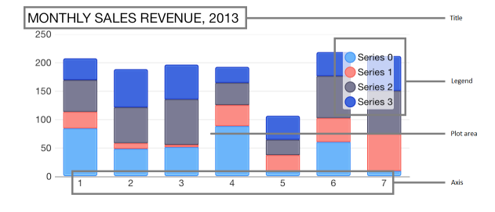
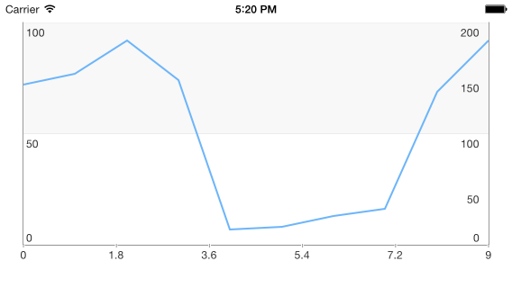

# Chart: Structure

<code>TKChart</code> consists of the following elements:



- <code>plot area</code> - this is the area where chart data is drawn.

- <code>series</code> - chart data is represented by series objects. Each series object defines the chart type and contains a set of points to be drawn. The chart can display different series object simultaneously.

- <code>axes</code> - there are four axes areas that surround the plot area. The axes define the dimensions in which data is drawn inside the plot area. Each axis can be attached to a single or many series.

- <code>title</code> - this is the chart title. Its style and position can be customized. The chart title is hidden by default.

- <code>legend</code> - the chart legend displays additional information about series objects. Its style and position can be customized. The chart legend is hidden by default.

In addition to these visual objects, TKChart uses the following protocols:

- <code>dataSource</code> - The chart data source is used to supply the chart with data. Setting this property is optional, as you can assign data directly to the series object. In case you decide to use this property, you have to implement the TKChartDataSource* protocol.

- <code>delegate</code> - The chart delegate is an optional protocol that allows chart consumers to receive notifications from <code>TKChart</code>. It allows also customizing chart appearance and animations.

## Axes ##

<code>TKChart</code> renders its points in a coordinate system defined by its axes. To do this, axes specify the minimum and maximum values that can be presented on the plot area. There are a few different types of axes that can be used with <code>TKChart</code>. They include: numeric, date/time and categoric. You can assign each axis to different series and you can show multiple axes in a chart. Axes contain various properties to control their position, style and behavior. All chart axes subclass from <code>TKChartAxis</code>.

- Use <code>TKChartNumericAxis</code> to present numeric values.
- Use <code>TKChartDateTimeAxis</code> to present date/time values.
- Use <code>TKChartCategoryAxis</code> to present categoric values.

In order to show multiple axes in <code>TKChart</code>, create several axes and customize their position. Then use the <code>xAxis</code> and <code>yAxis</code> properties of the series to assign them:

```Objective-C
    TKChartNumericAxis *xAxis = [[TKChartNumericAxis alloc] init];
    xAxis.position = TKChartAxisPositionBottom;
    [chart addAxis:xAxis];
    
    TKChartNumericAxis *yAxis1 = [[TKChartNumericAxis alloc] initWithMinimum:@0 andMaximum:@100];
    yAxis1.majorTickInterval = @50;
    yAxis1.position = TKChartAxisPositionLeft;
    yAxis1.style.lineHidden = NO;
    [chart addAxis:yAxis1];
    
    TKChartNumericAxis *yAxis2 = [[TKChartNumericAxis alloc] initWithMinimum:@0 andMaximum:@200];
    yAxis2.majorTickInterval = @50;
    yAxis2.position = TKChartAxisPositionRight;
    yAxis2.style.lineHidden = NO;
    [chart addAxis:yAxis2];
    
    NSArray *values1 = @[@12, @10, @98, @64, @11, @27, @85, @72, @43, @39];
    NSMutableArray *incomesData = [[NSMutableArray alloc] init];
    for (int i = 0; i < values1.count; i++) {
        [incomesData addObject:[[TKChartDataPoint alloc] initWithX:@(i) Y:values1[i]]];
    }
    
    TKChartLineSeries *series = [[TKChartLineSeries alloc] initWithItems:incomesData];
    series.xAxis = xAxis;
    series.yAxis = yAxis1;
    [chart addSeries:series];
```
```Swift
    let xAxis = TKChartNumericAxis()
    xAxis.position = TKChartAxisPosition.Bottom
    chart.addAxis(xAxis)
        
    let yAxis1 = TKChartNumericAxis(minimum: 0, andMaximum: 100)
    yAxis1.majorTickInterval = 50
    yAxis1.position = TKChartAxisPosition.Left
    yAxis1.style.lineHidden = false
    chart.addAxis(yAxis1)
        
    let yAxis2 = TKChartNumericAxis(minimum: 0, andMaximum: 200)
    yAxis2.majorTickInterval = 50
    yAxis2.position = TKChartAxisPosition.Right
    yAxis2.style.lineHidden = false
    chart.addAxis(yAxis2)
        
    var incomesData = [TKChartDataPoint]()
    let values1 = [12, 10, 98, 64, 11, 27, 85, 72, 43, 39]
    for i in 0..<10 {
        incomesData.append(TKChartDataPoint(x: i, y: values1[i]))
    }
        
    let series = TKChartLineSeries(items: incomesData)
    series.xAxis = xAxis
    series.yAxis = yAxis1
    chart.addSeries(series)
```
```C#
var xAxis = new TKChartNumericAxis ();
xAxis.Position = TKChartAxisPosition.Bottom;
chart.AddAxis (xAxis);

var yAxis1 = new TKChartNumericAxis (new NSNumber (0), new NSNumber (100));
yAxis1.MajorTickInterval = 50;
yAxis1.Position = TKChartAxisPosition.Left;
yAxis1.Style.LineHidden = false;
chart.AddAxis (yAxis1);

var yAxis2 = new TKChartNumericAxis (new NSNumber (0), new NSNumber (200));
yAxis2.MajorTickInterval = 50;
yAxis2.Position = TKChartAxisPosition.Right;
yAxis2.Style.LineHidden = false;
chart.AddAxis (yAxis2);

var incomesData = new List<TKChartDataPoint> ();
var values1 = new [] { 12, 10, 98, 64, 11, 27, 85, 72, 43, 39 };
for (int i=0; i<10; i++) {
    incomesData.Add (new TKChartDataPoint (new NSNumber(i), new NSNumber(values1 [i])));
}

var series = new TKChartLineSeries (incomesData.ToArray());
series.XAxis = xAxis;
series.YAxis = yAxis1;
chart.AddSeries (series);
```

The result from this setup is:



Find further details about chart axes in [this article](axes/axes).

## Series ##

Series define how data should be visually presented on the plot area. Each series has a collection of data points, which it displays according to the series type. <code>TKChart</code> supports several series out of the box. These include: bar, column, line, area, scatter and pie. The base class for all series in <code>TKChart</code> is <code>TKChartSeries</code>.

- [TKChartAreaSeries](series/area) is used to present points in filled areas.
- [TKChartBubbleSeries](series/bubble) is used to present points of various size.
- [TKChartCandlestickSeries](series/candlestick) and [TKChartOhlcSeries](series/ohlc) are used to present stock market data.
- [Financial indicators](series/candlestick) are used to present calculated summary of stock market data.
- [TKChartBarSeries](series/bar) is used to present points as bars (horizontal rectangles).
- [TKChartColumnSeries](series/column) is used to present points as columns (vertical rectangles).
- [TKChartDonutSeries](series/donut) is used to present data as a pie.
- [TKChartSplineSeries](series/spline) is used to present points as a spline.
- [TKChartSplineAreaSeries](series/area) is used to present points in filled areas having a spline line at the top.
- [TKChartLineSeries](series/line) is used to present points as line/spline.
- [TKChartPieSeries](series/pie) is used to present data as pie.
- [TKChartScatterSeries](series/scatter) is used to present data as separate points.

When <code>TKChart</code> contains more than one series of type bar or column, it clusters the series in groups. You can choose also to show the same information as stacked bars/columns. This is done by setting the <code>stackInfo</code> property of the series:

```Objective-C
NSArray *values1 = @[@12, @10, @98, @64, @11, @27, @85, @72, @43, @39];
NSArray *values2 = @[@87, @22, @29, @87, @65, @99, @63, @12, @82, @87];
NSMutableArray *expensesData = [[NSMutableArray alloc] init];
NSMutableArray *incomesData = [[NSMutableArray alloc] init];
for (int i = 0; i < values1.count; i++) {
    [expensesData addObject:[[TKChartDataPoint alloc] initWithX:@(i) Y:values2[i]]];
    [incomesData addObject:[[TKChartDataPoint alloc] initWithX:@(i) Y:values1[i]]];
}

TKChartStackInfo *stackInfo = [[TKChartStackInfo alloc] initWithID:@(1) withStackMode:TKChartStackModeStack];
TKChartSeries *series1 = [[TKChartColumnSeries alloc] initWithItems:expensesData];
series1.title = @"Expenses";
series1.stackInfo = stackInfo;
[chart addSeries:series1];

TKChartSeries *series2 = [[TKChartColumnSeries alloc] initWithItems:incomesData];
series2.title = @"Incomes";
series2.stackInfo = stackInfo;
[chart addSeries:series2];
```
```Swift
let values1 = [12, 10, 98, 64, 11, 27, 85, 72, 43, 39]
let values2 = [87, 22, 29, 87, 65, 99, 63, 12, 82, 87]    
var expensesData = [TKChartDataPoint]()
var incomesData = [TKChartDataPoint]()
for i in 0..<10 {
    expensesData.append(TKChartDataPoint(x: i, y: values2[i]))
    incomesData.append(TKChartDataPoint(x: i, y: values1[i]))
}
    
let stackInfo = TKChartStackInfo(ID: 1, withStackMode: TKChartStackMode.Stack)
let series1 = TKChartColumnSeries(items: expensesData)
series1.title = "Expenses"
series1.stackInfo = stackInfo
chart.addSeries(series1)
   
let series2 = TKChartColumnSeries(items: incomesData)
series2.title = "Incomes"
series2.stackInfo = stackInfo
chart.addSeries(series2)
```
```C#
var values1 = new [] { 12, 10, 98, 64, 11, 27, 85, 72, 43, 39 };
var values2 = new [] { 87, 22, 29, 87, 65, 99, 63, 12, 82, 87 };
var expensesData = new List<TKChartDataPoint>();
var incomesData = new List<TKChartDataPoint>();
for (int i=0; i<10; i++) {
    expensesData.Add(new TKChartDataPoint(new NSNumber(i), new NSNumber(values2[i])));
    incomesData.Add(new TKChartDataPoint(new NSNumber(i), new NSNumber(values1[i])));
}

var stackInfo = new TKChartStackInfo(new NSNumber(1), TKChartStackMode.Stack);

var series1 = new TKChartColumnSeries(expensesData.ToArray());
series1.Title = "Expenses";
series1.StackInfo = stackInfo;
chart.AddSeries(series1);

var series2 = new TKChartColumnSeries(incomesData.ToArray());
series2.Title = "Incomes";
series2.StackInfo = stackInfo;
chart.AddSeries(series2);
```

The result from this setup is:


Line and area series also allow stacking by using the <code>stackInfo</code> property.

Series appearance can be changed by using the <code>style</code> property.

## Interaction ##

<code>TKChart</code> is an interactive component that supports gestures like touch, pan and rotate. The main actions that are supported are selection and pan/zoom interaction.

The <code>allowPan</code> and <code>allowZoom</code> properties of TKChartSeries should be set to *YES* in order to allow pan/zoom functionality.

The <code>selectionMode</code> property of TKChartSeries should be set to <code>TKChartSelectionModeSeries</code> or <code>TKChartSelectionModeDataPoint</code> in order to allow selection for the specified series.

Find further details about selection and pan/zoom functionality in the corresponding articles.

## Animations ##

<code>TKChart</code> allows animating chart points by using the CoreAnimation framework. There are built-in animations specific for every series type and you can define your own animations by implementing methods in the chart delegate.

You can customize the default animation by implementing the TKChartDelegate interface and overriding its <code>chart:animationForSeries:withState:inRect:</code> method:

The <code>allowAnimations</code> property of TKChart should be set to *YES* in order to work with animations.

```Objective-C
- (CAAnimation *)chart:(TKChart *)chart animationForSeries:(TKChartSeries *)series withState:(TKChartSeriesRenderState *)state inRect:(CGRect)rect
{
    CFTimeInterval duration = 0;
    NSMutableArray *animations = [[NSMutableArray alloc] init];
    
    for (int i = 0; i<state.points.count; i++) {
        NSString *keyPath = [NSString stringWithFormat:@"%@.x", [state animationKeyPathForPointAtIndex:i]];
        TKChartVisualPoint *point = [state.points objectAtIndex:i];
        CABasicAnimation *animation = [CABasicAnimation animationWithKeyPath:keyPath];
        animation.duration = (arc4random() % 100) / 100.;
        animation.fromValue = @0;
        animation.toValue = @(point.x);
        [animations addObject:animation];
        duration = MAX(animation.duration, duration);
    }
    
    CAAnimationGroup *group = [[CAAnimationGroup alloc] init];
    group.duration = duration;
    group.animations = animations;
    
    return group;
}
```
```Swift
func chart(chart: TKChart!, animationForSeries series: TKChartSeries!, withState state: TKChartSeriesRenderState!, inRect rect: CGRect) -> CAAnimation! {
    var duration = 0.0
    var animations = [CAAnimation]()
    for i in 0..<state.points.count() {
        let pointKeyPath = state.animationKeyPathForPointAtIndex(i)
        let keyPath = pointKeyPath + ".x"
        let point: TKChartVisualPoint = state.points[i] as TKChartVisualPoint
        let animation = CABasicAnimation(keyPath: keyPath)
        animation.duration = Double(arc4random_uniform(100)) / 100.0
        animation.fromValue = 0
        animation.toValue = point.x
        animations.append(animation)
        duration = max(animation.duration, duration)
    }
    
    let group = CAAnimationGroup()
    group.duration = duration
    group.animations = animations
    return group
}
```
```C#
class ChartDelegate: TKChartDelegate
{
    Random r = new Random ();

    public override CAAnimation AnimationForSeries (TKChart chart, TKChartSeries series, TKChartSeriesRenderState state, CGRect rect)
    {
        var duration = 0.0;
        var animations = new List<CAAnimation> ();
        for (int i=0; i<(int)state.Points.Count; i++) {
            var pointKeyPath = state.AnimationKeyPathForPointAtIndex ((uint)i);
            var keyPath = pointKeyPath + ".x";
            var point = state.Points.ObjectAtIndex((uint)i) as TKChartVisualPoint;
            var animation = new CABasicAnimation ();
            animation.KeyPath = keyPath;
            animation.Duration = (double) (r.Next (100)) / 100.0;
            animation.From = new NSNumber(0);
            animation.To = new NSNumber(point.X);
            animations.Add (animation);
            duration = Math.Max(animation.Duration, duration);
        }

        var group = new CAAnimationGroup ();
        group.Duration = duration;
        group.Animations = animations.ToArray();
        return group;
    }
}
```

This method returns a single animation, therefore if you create multiple animations, you should group them inside CAAnimationGroup.

Besides the CoreAnimation framework, </code>TKChart</code> allows animating its points by adding real world physics by using the new UIKitDynamics framework introduced in iOS 7. With this framework you can add different behaviors like gravity, elasticity and forces. Read further details about this advanced topic in [this article](animations/custom-uikit-dynamics).

