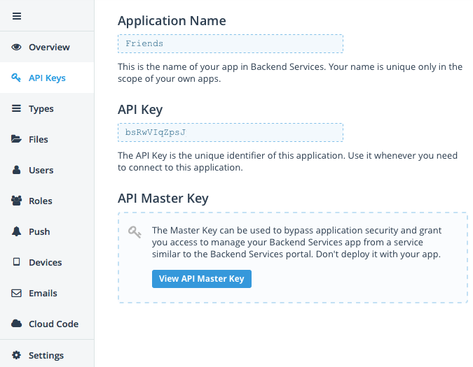
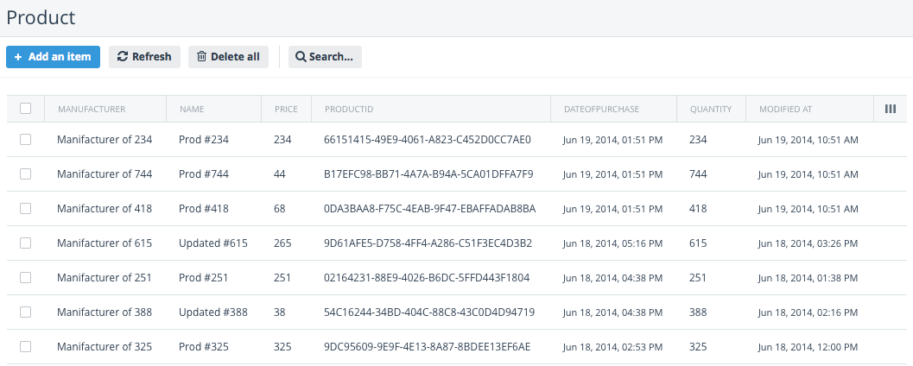
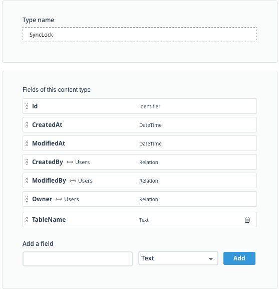

# DataSync: Getting Started with Data Synchronization

The most advanced and important part of the DataSync component is of course its data-sync functionality. The DataSync components synchronizes the locally stored data with the Telerik Backend Services. Thanks to the flexible API, the DataSync component allows you to have control over the synching strategy in terms of whether the local or the cloud data will win in case of a conflict, or in case a custom conflict resolving logic is required, you can implement your own in s specified method.

In order to persist the client side changes on the Telerik Backend Services, you should have a valid licence for it and create a new Backend Services **Platform** application. The unique **ApiKey** string that is assigned to your application is required in order to be able to use backend services as a centralized storage for merged data of your client application instances. You can find it in ApiKey section as it is shown here:

In addition to this string, you should get the user’s **access token** that is returned during the user authentication to the **Telerik Platform**. These two string values are required for communications with the Backend Services. You can get the access token as it is described at the following article: [Getting the Access Token for ApiKey](getting-the-access-token-for-apikey). If you use a third party authentication service you can just define a dummy user for your application and get its access token accordingly right after the successful authorization as it is described in the article.

The next step when you are ready with your business model is to define the backend types that correspond to entity classes of your model. Let’s continue with **Product** class from the [Local Data Persistence](getting-started-local-data-persistence) article. In order to be able to synchronize it between different users we should ensure the uniquness of the primary key field for all instances that will be created by all of the users during the whole life of the application. That’s why the current type for primary key is not suitable. We will change it to NSString* and will generate unique values as follows:

	//declaration
	@property(nonatomic,strong)NSString* productID;
	...
	//initialization
	self.productID = [[NSUUID UUID] UUIDString];

Now we should define a new backend type with name **Product** with fields as follows:

The real values will look like this:

You will see that every backend type has some additional system fields related to the creation/modification time of records. These fields are not an object of interest, so left them as is. When you are ready with duplication of business model, you should create a system table that is required for synchronization algorithm. The name of this table must be “**SyncLock**” and it has only one additional field “**TableName**” of type “**Text**”.

This is everything you should prepare at the backend in order to allow your native iOS application to be able to use the synchronization engine of **DataSync** component.
Now, you should initialize the backend data services provider with obtained strings of ApiKey and access token as follows:

	NSString* apiKey =  @"bsRwVIZpABCDEFG"; 	// unique per application
	NSString* accessToken =				//obtained from Auth request's response @"FBqO1Uj4wDIejjjgBt7mCgjNcYAYs1gf6aUBZVt8oLyS6h9riy3YHB8IR0fSeJUYcdZ9q7j0QvTTpe6FzUetL5an4yR4mR8v8DSXPjrBAxObinr3uFt6VpVI1NMLYZPVUZwES9fFWD3LqgG4cQVjQlzF5qzpzdsRfZ9kTBLQHwWtLYi49ABCDEFGH";

	TKEverliveClient*  everlive = [TKEverliveClient clientWithApiKey:apiKey
    					                                  accessToken:accessToken
                       						           serviceVersion:@1];

This client object can be defined as static and lazy created on demand after the user logs in.

Next step is to initialize the synchronization policy object as follows:

	TKReachabilityOptions options = TKSyncIn3GNetwork | TKSyncInWIFINetwork;
	TKSyncPolicy* policy = [[TKSyncPolicy alloc] initForSyncOnDemandWithReachabilityOptions:options
    				                                                   conflictResolutionType:TKPreferLocalInstance
                   	            		                                           syncTimeout:100.0]; //in seconds

	context = [[TKDataSyncContext alloc] initWithLocalStoreName:@"localDBName" cloudService:everlive syncPolicy:policy];

**TKReachabilityOptions** values marks in which states of network reachability the synchronization should be executed. This is valuable in case of expensive internet data transfer rates.

**TKSyncPolicy** instance determines the behavior of synchronization algorithm and defines the conflict resolution mode for entities that should be merged. In the example above we used the **TKPreferLocalInstance** value and this gives priority to the locally changed data during the conflict resolution. In other words, if the client has changed a record and wants to synchronize it with data on the cloud, but the same record has been changed by another client and already synchronized to the cloud the local changes will override the changes in the cloud. From this moment on, all other users will get this value as a result of synchronization. The cloud changes are of higher importance if the **TKPreferCloudInstance** value is set.
The most interesting case is if there is a more complicated merging procedure that developer wants to implement. Then the **TKCustomResolution** value should be used. This allows to the developer to handle all conflicts and implement his own merging algorithm. To achieve this, you should implement the **TKDataSyncDelegate** protocol and set its implementation as a conflict resolver using the setter of the delegate property of the context:

- (void)setDelegate:(id<TKDataSyncDelegate>) delegate;

The **TKDataSyncDelegate** protocol provides callbacks that will be called during the synchronization process.

