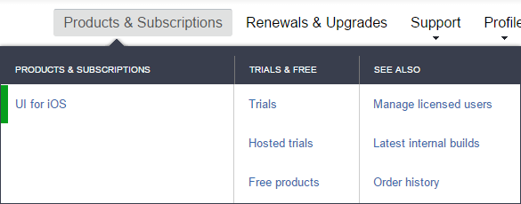
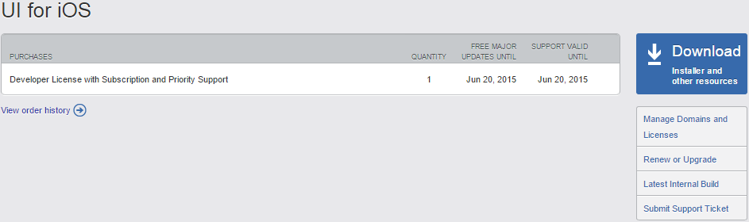
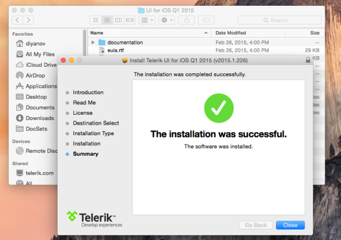

# UI for iOS: Getting Started

=======
This tutorial demonstrates how to create a simple iOS application with Telerik UI for iOS and its Chart for iOS.


## Downloading UI for iOS

In order to use Chart for iOS, you have to download and install the latest version Telerik UI for iOS as shown below.


### Trial version

You can download the Trial version of UI for iOS from [http://www.telerik.com/download/ios-ui](http://www.telerik.com/download/ios-ui). Clicking the Download installer button will download the installation package - Telerik UI for iOS.pkg. 

### Paid version

If you have already purchased UI for iOS, DevCraft Ultimate or Telerik Platform Professional/Business, you should first log in to your Telerik account and follow the steps below:

#### UI for iOS purchase

1. Go to *Products & Subscriptions >> UI for iOS*.
  
  
2. Click the *Download Installer and other resources* button.
  
  
3. Download the *Automatic Installation* file.
  
  

#### DevCraft Ultimate purchase

1. Go to *Products & Subscriptions >> DevCraft Ultimate*.
  
  
2. Click the *Download Installer and other resources* button.
  
  
3. Find the *UI for iOS* box from the list of available products and click the *Download* button to download the installer.
  
  

##### Telerik Platform Professional/Business purchase

1. Go to *Products & Subscriptions >> Telerik Platform*.
  
  
2. Click the *Download Installer and other resources* button.
  
  
3. Find the *UI for iOS* box from the list of available products and click the *Download* button to download the installer.
  
  


## Installing UI for iOS

Double-click the installer file that you have just downloaded and the installer will guide you through the installation process. When done it will open the newly created folder in your Documents folder. 
  


## Setting up the project

After installing <code>TKChart</code>, you can proceed with the following steps:

<ol>
    <li>Open Xcode and choose <i>"Create a new Xcode project"</i>.</li>
    <li>Choose <i>"Single View Application"</i> from the <i>"Choose a template for your new project"</i> dialog.</li>
    <li>Give your project a name and click <i>Next</i>.</li>
    <li>Complete the process of creating a project by specifying the location for your project and clicking <i>Create</i>.</li>
    <li>Scroll down to the <i>Linked Frameworks and Libraries</i> section in your project settings and click on the <i>"+"</i> button. <br/>
    </li>
    <li>Type <i>telerik</i> in the popup, select the <i>TelerikUI.framework</i> and click <i>Add</i>. <br/>
    </li>
    <li>This is it, now you are ready to start working with Telerik Chart.</li>
</ol>

## Setting up TKChart

Now that our project is created and the TelerikUI.framework is added, we can start referencing and using the TelerikUI types:

Open your **ViewController.m** file and add a reference to the chart header file:

    #import <TelerikUI/TelerikUI.h>

Note that starting with Xcode 6 Apple doesn't generate the precompiled headers file automatically. That is why you should add import the UIKit framework before importing TelerikUI:

    #import <UIKit/UIKit.h>

If you are writing Swift, add the same line in your bridging header.

If you are using Xamarin, add a reference to TelerikUI.dll in your project and use the using directive:

    using TelerikUI;

Type the following code in <code>viewDidLoad</code> method:

```Objective-C
TKChart *chart = [[TKChart alloc] initWithFrame:CGRectInset(self.view.bounds, 15, 15)];
chart.autoresizingMask = UIViewAutoresizingFlexibleWidth | UIViewAutoresizingFlexibleHeight;
[self.view addSubview:chart];
```
```Swift
let chart = TKChart(frame: CGRectInset(self.view.bounds, 15, 15))
chart.autoresizingMask = UIViewAutoresizing.FlexibleWidth | UIViewAutoresizing.FlexibleHeight
self.view.addSubview(chart)
```
```C#
var chart = new TKChart (CGRect.Inflate (this.View.Bounds, -15, -15));
chart.AutoresizingMask = UIViewAutoresizing.FlexibleWidth | UIViewAutoresizing.FlexibleHeight;
this.View.AddSubview (chart);
```

This code creates a new instance of TKChart and adds it as a subview of the ViewController's main view. The <code>autoresizingMask</code> property is set in order to allow correct resizing of the chart when the device is rotated in landscape mode.

The next step is to create some random data that will be consumed by the chart. You can use the following code:

```Objective-C
NSMutableArray *randomNumericData = [[NSMutableArray alloc] init];
for (int i=0; i<10; i++) {
    [randomNumericData addObject:[[TKChartDataPoint alloc] initWithX:@(i) Y:@(arc4random()%100)]];
}
```
```Swift
var randomNumericData = [TKChartDataPoint]()
for i in 0..<10 {
    randomNumericData.append(TKChartDataPoint(x: i, y: Double(arc4random() % 100)))
}
```
```C#
Random r = new Random ();
var randomNumericData = new List<TKChartDataPoint> ();
for (int i=0; i<10; i++) {
    randomNumericData.Add (new TKChartDataPoint (new NSNumber (i), new NSNumber (r.Next (100))));
}
```

In this case we use the *i* variable as an x value, and we generate a random number in the range between 0 and 100 as an y value.

Now let's add this random data to the chart and present it. This is done by the following code:

```Objective-C
[chart addSeries:[[TKChartLineSeries alloc] initWithItems:randomNumericData]];
```
```Swift
chart.addSeries(TKChartLineSeries(items: randomNumericData))
```
```C#
chart.AddSeries (new TKChartLineSeries (randomNumericData.ToArray ()));
```

For more information about populating TKChart with data, please refer to the following article:

- [Populating with Data](populating-with-data)

The TKChartLineSeries tells the chart to present its data as a line chart and initializes it with the already created points.

Let's add a title and a legend to our chart. We can do so by setting the corresponding properties to NO:

```Objective-C
chart.title.hidden = NO;
chart.title.text = @"This is a chart demo";
chart.legend.hidden = NO;
```
```Swift
chart.title().hidden = false
chart.title().text = "This is a chart demo"
chart.legend().hidden = false
```
```C#
chart.Title.Hidden = false;
chart.Title.Text = "This is a chart demo";
chart.Legend.Hidden = false;
```

Finally, we can easily employ the built-in animations support to create some fancy animations. To do so, we should set the <code>allowAnimations</code> property to *YES*:

```Objective-C
chart.allowAnimations = YES;
```
```Swift
chart.allowAnimations = true
```
```C#
chart.AllowAnimations = true;
```

For more information about customizing animations, please refer to the following articles:

- [Custom Animations](animations/custom)
- [Custom UIKit Dynamics Animations](animations/custom-uikit-dynamics)

Here is the full code of this example:

```Objective-C
#import "ViewController.h"
#import <TelerikUI/TelerikUI.h>

@implementation ViewController

- (void)viewDidLoad
{
    [super viewDidLoad];

    TKChart *chart = [[TKChart alloc] initWithFrame:CGRectInset(self.view.bounds, 15, 15)];
    chart.autoresizingMask = UIViewAutoresizingFlexibleWidth | UIViewAutoresizingFlexibleHeight;
    [self.view addSubview:chart];

    NSMutableArray *randomNumericData = [[NSMutableArray alloc] init];
    for (int i=0; i<10; i++) {
       [randomNumericData addObject:[[TKChartDataPoint alloc] initWithX:@(i) Y:@(arc4random()%100)]];
    }

    [chart addSeries:[[TKChartLineSeries alloc] initWithItems:randomNumericData]];

    chart.title.hidden = NO;
    chart.title.text = @"This is a chart demo";
    chart.legend.hidden = NO;

    chart.allowAnimations = YES;
}

@end
```

```Swift
class ViewController: UIViewController {

    override func viewDidLoad() {
        super.viewDidLoad()

        let chart = TKChart(frame: CGRectInset(self.view.bounds, 15, 15))
        chart.autoresizingMask = UIViewAutoresizing.FlexibleWidth | UIViewAutoresizing.FlexibleHeight
        self.view.addSubview(chart)
        
        var randomNumericData = [TKChartDataPoint]()
        for i in 0..<10 {
            randomNumericData += TKChartDataPoint(x: i, y: Double(arc4random() % 100))
        }
        
        chart.addSeries(TKChartLineSeries(items: randomNumericData))
        
        chart.title().hidden = false
        chart.title().text = "This is a chart demo"
        chart.legend().hidden = false
        
        chart.allowAnimations = true    
    }
}
```
```C#
public class ChartGettingStarted: UIViewController
{
    public override void ViewDidLoad ()
    {
        base.ViewDidLoad ();

        var chart = new TKChart (RectangleF.Inflate (this.View.Bounds, -15, -15));
        chart.AutoresizingMask = UIViewAutoresizing.FlexibleWidth | UIViewAutoresizing.FlexibleHeight;
        this.View.AddSubview (chart);

        Random r = new Random ();
        var randomNumericData = new List<TKChartDataPoint> ();
        for (int i=0; i<10; i++) {
            randomNumericData.Add (new TKChartDataPoint (new NSNumber (i), new NSNumber (r.Next (100))));
        }

        chart.AddSeries (new TKChartLineSeries (randomNumericData.ToArray ()));

        chart.Title.Hidden = false;
        chart.Title.Text = "This is a chart demo";
        chart.Legend.Hidden = false;

        chart.AllowAnimations = true;
    }
}
```

You can easily change the way data is presented in chart by changing the series type:

```Objective-C
[chart addSeries:[[TKChartColumnSeries alloc] initWithItems:randomNumericData]];
```
```Swift
chart.addSeries(TKChartColumnSeries(items: randomNumericData))
```
```C#
chart.AddSeries (new TKChartColumnSeries (randomNumericData.ToArray ()));
```

For more information about series types, please refer to the following articles: [Chart Structure](structure).