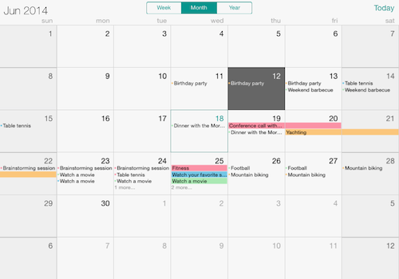

# UI for iOS: Overview

Telerik UI for iOS suite delivers functionalities, built with performance in mind, that allow you to build unique and visually stunning iOS applications. Getting started and integrating the Telerik UI for iOS components in your Xcode project is very straightforward thanks to the easy to use API. The methods and properties are self-explanatory, the architecture is easy to follow. Our controls give you great customization flexibility to accommodate as many app scenarios as possible.

Here are the available UI for iOS component at a glance:

**TKChart** is a versatile charting component that offers full customization, great performance and intuitive object model. Its API allows creating complex charts with stunning animations and appearance.

TKChart main features include:

- Various series types: bar, column, line, spline, area, pie, donut, scatter, financial series and indicators.
- Stacking of bar, column, line and area series including stack 100 mode.
- Pan/Zoom and selection functionality.
- Animations that use the CoreAnimations and UIKit dynamics.
- Multiple axes.

**TKCalendar** is a calendar control that features week, month and year views as well as multiple dates selection and flexible API for customization. TKCalendar main features include:

- Week, Month and Year Views.
- Support for Events - custom or provided by the EventKit.
- Single, Multiple and Range Selection.
- Localization.
- Flexible styling API.

**TKFeedbackController** enables your end-users to provide feedback inside your app by simply shaking their device or navigating to the feedback option. Once invoked, the component will automatically take a screenshot and prompt users to point to their issue and provide a comment. The users can then track the feedback they've submitted, viewing its status or supplying additional comments. The component's seamless integration with AppFeedback (a part of the Telerik Platform) allows for organizing and reviewing all feedback items, assigning those to members in your Telerik Platform workspace and responding directly to users. The end result is actionable feedback, and easy interaction between your users and team members.

The **DataSync** (Beta) component is a powerful new solution for synchronizing application data across all devices and the cloud. Its smart syncing algorithms taking place on the device will ensure that the changes made to data while offline, will be synced with the cloud once your app is connected again. On the cloud side, the data-sync framework is backed up by Telerik BaaS. On the device (client) side, the data-sync provides a lightweight ORM that allows you to model your data in SQLite.
