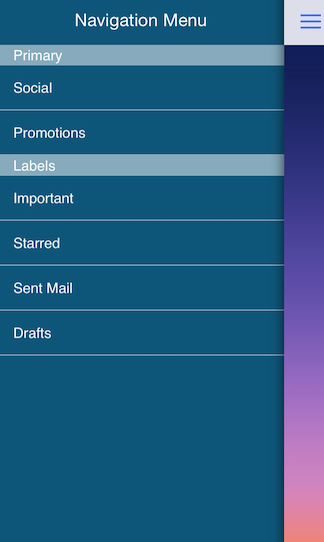

# TKSideDrawer: Customizations 



<code>TKSideDrawer</code> allows customizing almost every aspect of its visual appearance. This article demonstrates some of the customization techniques that can be used with it.

Most useful settings for changing the visual appearance of <code>TKSideDrawer</code> are grouped in its <code>style</code> property.

```Objective-C
	self.sideDrawer.style.headerHeight = 64;
    self.sideDrawer.fill = [TKSolidFill solidFillWithColor:TKRGBA(28, 171, 241, 0.5)];
    self.sideDrawer.style.shadowMode = TKSideDrawerShadowModeHostview;
    self.sideDrawer.style.shadowOffset = CGSizeMake(-2, -0.5);
    self.sideDrawer.style.shadowRadius = 5;
```

```Swift
	sideDrawer.style.headerHeight = 64
    sideDrawer.fill = TKSolidFill(color: UIColor(red: 28 / 255.0, green: 171/255.0, blue: 241/255.0, alpha:0.5))
    sideDrawer.style.shadowMode = TKSideDrawerShadowMode.Hostview
    sideDrawer.style.shadowOffset = CGSizeMake(-2, -0.5)
    sideDrawer.style.shadowRadius = 5
```

```C#
	SideDrawer.Style.HeaderHeight = 64;
	SideDrawer.Fill = new TKSolidFill (new UIColor (28.0f / 255.0f, 171.0f / 255.0f, 241.0f / 255.0f, 0.5f));
	SideDrawer.Style.ShadowMode = TKSideDrawerShadowMode.Hostview;
	SideDrawer.Style.ShadowOffset = new CGSize (-2f, -0.5f);
	SideDrawer.Style.ShadowRadius = 5;
```

There are cases when you may need to update the styles of specific TKSideDrawer items like the text color or if a separator should be drawn. This can be done by adopting the <code>TKSideDrawerDelegate</code> protocol and implementing its <code>sideDrawer:updateVisualsForItem:inSection:</code> method.

```Objective-C
- (void)sideDrawer:(TKSideDrawer *)sideDrawer updateVisualsForItem:(NSInteger)itemIndex inSection:(NSInteger)sectionIndex
{
    TKSideDrawerSection *section = sideDrawer.sections[sectionIndex];
    TKSideDrawerItem *item = section.items[itemIndex];
    item.style.contentInsets = UIEdgeInsetsMake(0, -5, 0, 0);
    item.style.separatorColor = [TKSolidFill solidFillWithColor:[UIColor colorWithWhite:1 alpha:0.5]];
    item.style.textColor = [UIColor whiteColor];
}
```

```Swift
func sideDrawer(sideDrawer: TKSideDrawer!, updateVisualsForItem itemIndex: Int, inSection sectionIndex: Int) {
   	let section = sideDrawer.sections()[sectionIndex] as TKSideDrawerSection
   	let item = section.items()[itemIndex] as TKSideDrawerItem
    item.style.contentInsets = UIEdgeInsetsMake(0, -5, 0, 0)
    item.style.separatorColor = TKSolidFill(color: UIColor(white: 1, alpha: 0.5))
    item.style.textColor = UIColor.whiteColor()
}
```

```C#
public override void UpdateVisualsForItem (TKSideDrawer sideDrawer, int itemIndex, int sectionIndex)
{
	TKSideDrawerItem item = sideDrawer.Sections[sectionIndex].Items[itemIndex];
	item.Style.ContentInsets = new UIEdgeInsets (0, -5, 0, 0);
	item.Style.SeparatorColor = new TKSolidFill (UIColor.FromWhiteAlpha(1.0f, 0.5f));
	item.Style.TextColor = UIColor.White;
}
```

If needed you can easily update the visual styles of the sections. This is done by implementing <code>TKSideDrawerDelegate</code> method <code>sideDrawer:updateVisualsForSection:</code>:

```Objective-C
- (void)sideDrawer:(TKSideDrawer *)sideDrawer updateVisualsForSection:(NSInteger)sectionIndex
{
    TKSideDrawerSection *section = sideDrawer.sections[sectionIndex];
    section.style.textColor = [UIColor whiteColor];
    section.style.contentInsets = UIEdgeInsetsMake(0, -15, 0, 0);
}
```

```Swift
func sideDrawer(sideDrawer: TKSideDrawer!, updateVisualsForSection sectionIndex: Int) {
    let section = sideDrawer.sections()[sectionIndex] as TKSideDrawerSection
    section.style.textColor = UIColor.whiteColor()
    section.style.contentInsets = UIEdgeInsetsMake(0, -15, 0, 0)
}
```

```C#
public override void UpdateVisualsForSection (TKSideDrawer sideDrawer, int sectionIndex)
{
	TKSideDrawerSection section = sideDrawer.Sections[sectionIndex];
	section.Style.TextColor = UIColor.White;
	section.Style.ContentInsets = new UIEdgeInsets (0, -15, 0, 0);
}
```
## Custom content
In some scenarios you may need to use custom views for <code>TKSideDrawer</code> header or footer. <code>TKSideDrawer</code> properties <code>headerView</code> and <code>footerView</code> inherit from <code>UIView</code> allowing you to use the view that best suit your needs:

```Objective-C
self.sideDrawer.headerView = [[SideDrawerHeaderView alloc] init];
self.sideDrawer.footerView = [[SideDrawerFooterView alloc] init];
```

```Swift
self.sideDrawer.headerView = SideDrawerHeaderView()
self.sideDrawer.footerView = SideDrawerFooterView()
```

```C#
this.SideDrawer.HeaderView = new SideDrawerHeaderView ();
this.SideDrawer.FooterView = new SideDrawerFooterView ();
```

Setting the <code>content</code> property of <code>TKSideDrawer</code> you can easily change the content of the side drawer. It also inherits from <code>UIView</code>. By default the content is <code>TKSideDrawerTableView</code>.

