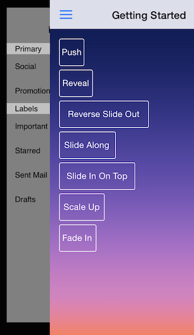
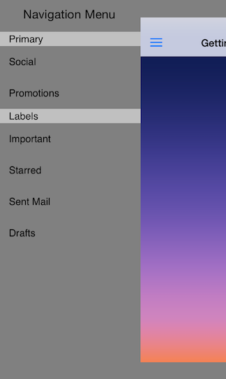

# TKSideDrawer: Transitions

<code>TKSideDrawer</code> transitions let you use different animation effects for showing/dismissing <code>TKSideDrawer</code>. You can also easily create your custom animation by subclassing the base class <code>TKSideDrawerTransition</code>.



The available transitions are: *SlideInOnTop, SlideAlong, ScaleUp, ReverseSlideOut, Reveal, Push, FadeIn*. The default transition is *SlideInOnTop*. To change the transition type you should set the <code>transition</code> property of <code>TKSideDrawer</code>:

```Objective-C
	self.sideDrawer.transition = TKSideDrawerTransitionTypeReveal;
```

```Swift
	self.sideDrawer.transition = TKSideDrawerTransitionType.Reveal
```

```C#
	this.SideDrawer.Transition = TKSideDrawerTransitionType.Reveal;
```

You can configure the speed of the transition setting the <code>transitionDuration</code> property of <code>TKSideDrawer</code>:

```Objective-C
	self.sideDrawer.transitionDuration = .2;
```

```Swift
	self.sidedrawer.transitionDuration = 0.2
```

```C#
	this.SideDrawer.TransitionDuration = 0.2f;
```

## Using Custom Transition

You can create a custom transition by sublcassing <code>TKSideDrawerTransition</code> and overriding its methods. After you create your transtion you should tell the side drawer to use it by setting its <code>transitionManager</code> property.



```Objective-C
	self.sideDrawer.transitionManager = [[ScaleContentTransition alloc] initWithSideDrawer:sideDrawer];
```

```Swift
	sideDrawer.transitionManager = ScaleContentTransition(sideDrawer: sideDrawer)
```

```C#
	ScaleContentTransition transition = new ScaleContentTransition (this.SideDrawer);
	this.SideDrawer.TransitionManager = transition;
```


